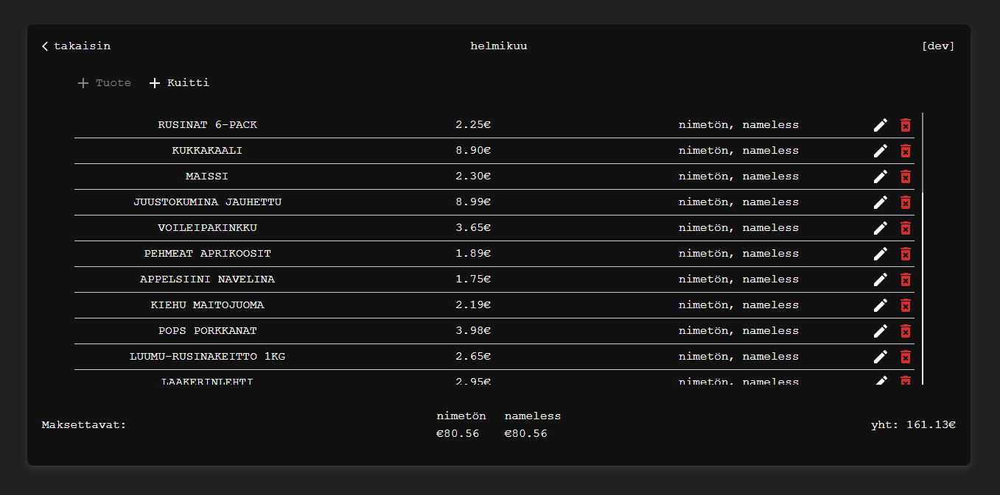
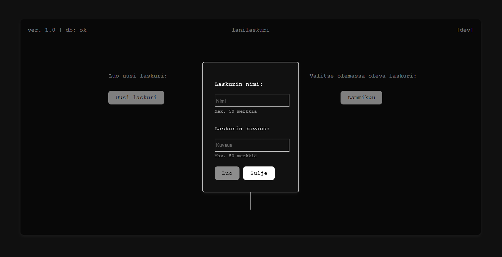
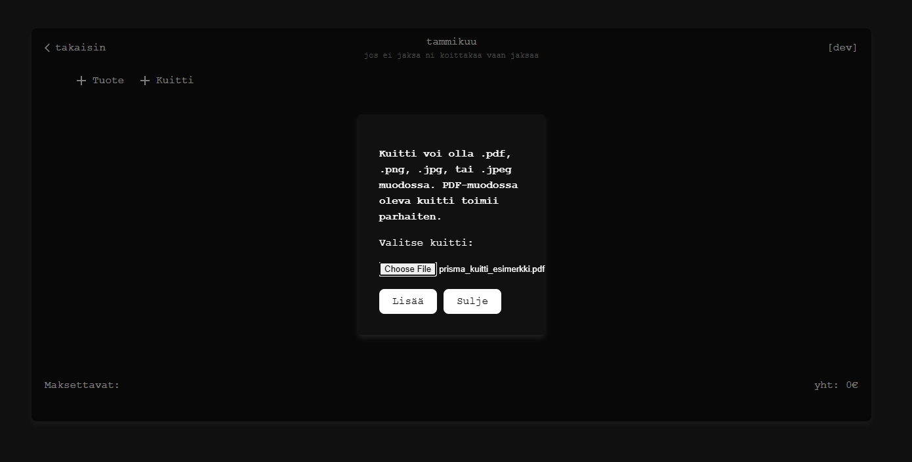
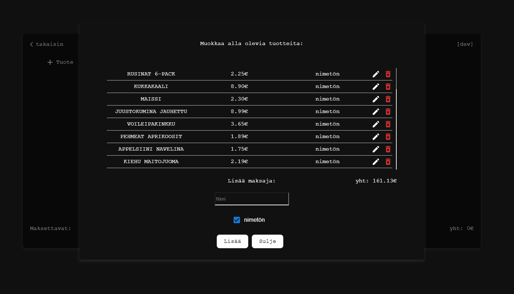

## 🎮 LAN Party Cost Management Tool

A project for managing costs for a LAN part, utilizing the ability to parse items from a receipt. The frontend is built with React + Vite, and the backend is powered by FastAPI + MongoDB.  
This project is intended to be run on Linux.  
All texts in the application are in Finnish. (Just a FYI if you want to run this and the texts don't make any sense.)

### 📂 Project Structure:

Backend: Handles API logic and database interactions.  
Frontend: Provides the user interface for managing events and costs.

---

### 💡 Important:

- Use consistent API keys between the frontend and backend.
- Ensure MongoDB is running before starting the backend server.
- Refer to FastAPI documentation and Vite documentation for advanced configurations.

---

### 🛠️ Backend Setup

For the backend, authentication is handled by creating a token for each user when logging in. A token is only created when the password is correct. The user can bypass the login page in the frontend if they really want, but no queries can be made.

1. Navigate to the Backend Folder

   `cd backend`

2. Set Up a Virtual Environment

   `python -m venv fastapi-env`

3. Activate the Virtual Environment  
   Windows:  
   `fastapi-env\Scripts\activate`  
   Linux/Mac:  
   `source fastapi-env/bin/activate`

4. Install Dependencies

   `pip install -r requirements.txt`

5. Install tesseract OCR engine

   `sudo apt-get install tesseract-ocr`

6. Install MongoDB

   `sudo apt install -y mongodb`

7. Start and Enable MongoDB

   `sudo systemctl start mongodb`  
   `sudo systemctl enable mongodb`

8. Run the FastAPI Server

   `uvicorn main:app --host your_ip --port your_port --reload`

9. Backend is Ready! 🎉

---

### 🌐 Frontend Setup:

1. Navigate to the Frontend Folder

   `cd frontend`

2. Install Dependencies

   `npm install`

3. Run the Development Server

   `npm run dev`

4. Frontend is Ready! 🎉

---

### 🚀 Deployment:

Backend:
Backend is deployed the same way as in the backend setup. Just run the uvicorn command in a linux `screen` or similar so it doesn't shut down when you close the cli.

Frontend:
Build the frontend in `frontend` directory by running `npm run build`. This command creates a `dist` directory. Copy the contents of the directory on a server that will be hosting the site.

---

### 📷 Couple more images:

